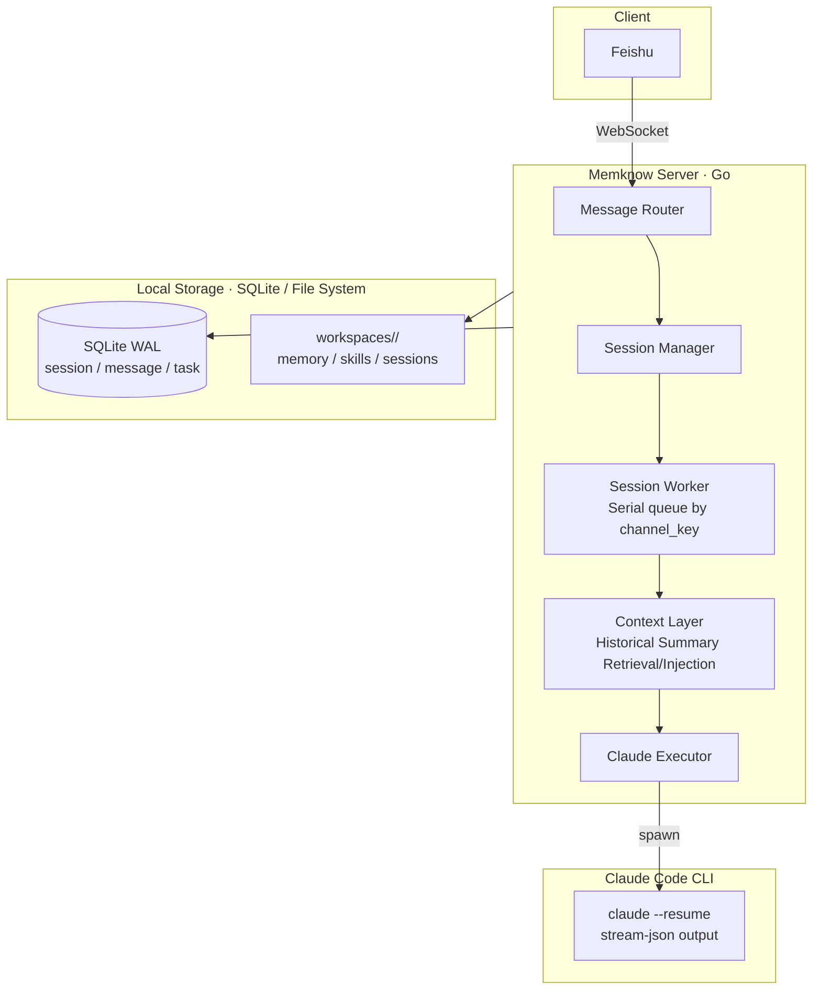

<div align="right">
  <span>[<a href="./README_EN.md">English</a>]</span>
  <span>[<a href="./README.md">简体中文</a>]</span>
</div>

<div align="center">
  <h1>Memknow</h1>
  <p>A long-term memory AI Agent platform based on Feishu.</p>
  <p>Each bot is a digital companion with memory, opinions, and the ability to grow.</p>
  <div align="center">
    
    
    
    
  </div>
  <br>
</div>

Memknow is a long-term memory AI Agent platform based on Feishu. Each business scenario corresponds to one Feishu application and an independent Claude Code workspace. When a user sends a message in Feishu, the framework automatically routes it to the corresponding workspace; after Claude processes it, the result is replied back to Feishu as a card. Cross-session conversation history and summaries are automatically stored in SQLite and retrieved/injected into the prompt during the next user input, achieving true long-term memory.

> ⚠️ **Prerequisite**: This project requires a machine with **Claude Code installed and logged in**. The framework acts as the scheduler and Feishu bridge for Claude Code and cannot replace Claude Code itself.

---

## Quick Start

### Prerequisites

- [Claude Code](https://docs.anthropic.com/claude-code) installed and logged in
- Go 1.24+
- Feishu Enterprise Account (Self-built application created with WebSocket mode enabled)

### Installation and Running

```bash
git clone https://github.com/ashwinyue/Memknow.git
cd Memknow
go mod download
go build -o server ./cmd/server

cp config.yaml.template config.yaml
# Edit config.yaml, fill in Feishu credentials and workspace paths
./server
```

Running as a background daemon:

```bash
make build
make daemon-install   # Auto-start on boot for Linux / macOS
make daemon-status
```

For detailed deployment instructions, please refer to `docs/quickstart.md`.

If you want to quickly understand how the system works, you can open the documentation home page directly:

- [`docs/`](docs/)

---

## Why Choose Memknow?

- **Long-Term Memory**: Shared memory across sessions; automatically retrieves historical summaries and injects them into the prompt, making the bot understand you better over time.
- **Multi-App Isolation**: A single codebase supports multiple completely isolated AI Agent scenarios, with each app possessing its own workspace and memory.
- **Zero Public Deployment**: Connects via Feishu WebSocket long connections, requiring no public IP, and can be deployed directly within a corporate intranet.
- **Full Agent Capabilities**: Full integration with Feishu for Claude Code's abilities such as reading/writing files, executing commands, and calling APIs.
- **Natural Language Scheduling**: Scheduled tasks and heartbeats can be created and managed via natural language, executed directly by the built-in scheduler.

---

## Features

### Core

- **Multi-App Isolation**: Each Feishu app corresponds to an independent workspace; sessions are isolated by `chat/heartbeat/schedule` directories, ensuring concurrency safety.
- **Automatic Context Injection**: Automatically retrieves summaries and historical messages from archived sessions before each conversation and injects them into the prompt for continuous cross-session memory.
- **Intelligent Session Management**: Full support for 1-on-1 chats, group chats, and topic groups. Automatically maintains Claude context; `/new` starts a new session, and idle sessions are automatically archived with a generated summary after a timeout.
- **File Lock Security**: Shared memory across sessions is protected by `flock` file locks to ensure concurrency safety.

### Agent Capabilities

- **Full Claude Code Power**: Direct access to tools like Read / Edit / Write / Bash / WebFetch. The workspace also includes a built-in local `bin/web-search` entry, prioritizing Tavily and automatically falling back to DuckDuckGo if not configured.
- **Attachment Support**: Images and files are automatically downloaded to the session directory. Pure attachment messages are intelligently cached and processed together after the user clarifies their intent.
- **Scheduled Tasks**: Create schedules via conversation; executed directly by the built-in `gocron` scheduler, eliminating the need to write YAML manually.
- **Built-in Heartbeat**: Heartbeats are managed by the framework's internal scheduler, triggered according to the `config.yaml` cycle, and automatically read `HEARTBEAT.md` to execute self-reflection tasks.
- **On-Demand Skill Loading**: Only a compact index is injected into the system prompt; full skill content is read via `Read` when needed to prevent prompt bloating.

### Management

- **YAML Configuration**: Single-file configuration based on Viper, supporting multi-app settings, whitelists, model overrides, and the principle of least privilege for tools.
- **Lightweight Runtime**: Go + SQLite WAL, CGO-free, zero dependencies on a single machine, capable of running on edge devices.
- **Event Logging**: Structured recording of specific events (cases), supporting historical case retrieval by time.

---

## Architecture



### channel_key Format

| Feishu Channel | channel_key Format | Supports /new |
|----------------|-------------------|---------------|
| 1-on-1 (P2P)   | `p2p:{chat_id}:{app_id}` | ✅ |
| Group Chat     | `group:{chat_id}:{app_id}` | ✅ |
| Topic Group    | `thread:{chat_id}:{thread_id}:{app_id}` | ❌ |

---

## Project Structure

```
Memknow/
├── cmd/server/main.go          # Service entry point
├── internal/
│   ├── config/                 # YAML configuration
│   ├── model/                  # GORM data models
│   ├── db/                     # SQLite WAL
│   ├── claude/                 # Subprocess calls to claude CLI
│   ├── feishu/                 # WS receiver + Card sender
│   ├── session/                # Worker queue + Memory retrieval + Search
│   ├── schedule/               # Built-in scheduled task scheduling
│   ├── heartbeat/              # Built-in heartbeat scheduling
│   ├── cleanup/                # Attachment cleanup
│   └── workspace/              # Workspace initialization
├── internal/workspace/template/# Default templates (embedded in binary)
├── workspaces/                 # Runtime workspaces (.gitignored)
├── docs/                       # Documentation
├── config.yaml.template        # Configuration template
├── Makefile                    # Common command wrappers
└── go.mod
```

### Local Search Entry

The following are generated during each workspace initialization:

- `bin/web-search`: A unified search command that the bot can call directly.
- `.search.json`: Runtime search configuration derived from `config.yaml`.

Default behavior:

- If `web_search.tavily_api_key` is configured, Tavily is prioritized.
- If not configured or Tavily fails, it automatically falls back to DuckDuckGo.
- Returns a unified JSON format for easy further reading and processing by the bot.

---

## Development

```bash
go build ./...
go test ./...
go vet ./...
gofmt -w .
```

For more documentation, please refer to the `docs/` directory.

---

## License

[MIT License](LICENSE)
