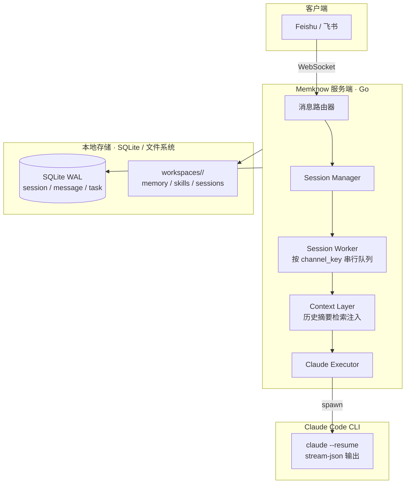

<div align="right">
  <span>[<a href="./README_EN.md">English</a>]</span>
  <span>[<a href="./README.md">简体中文</a>]</span>
</div>

<div align="center">
  <h1>Memknow</h1>
  <p>基于 Feishu 的长期记忆 AI Agent 平台。</p>
  <p>每个 bot 是一个有记忆、有主见、会成长的数字伙伴。</p>
  <div align="center">
    
    
    
    
  </div>
  <br>
</div>

Memknow 是一个基于 Feishu（飞书）的长期记忆 AI Agent 平台。每个业务场景对应一个飞书应用和一个独立的 Claude Code workspace。用户在飞书发送消息，框架将其路由到对应 workspace 执行 `claude` CLI，通过交互式卡片返回结果。

> ⚠️ **前提条件**：本项目需要一台**已安装并登录 Claude Code** 的机器。框架是 Claude Code 的调度器与飞书桥接层，不能替代 Claude Code 本身。个人微信: bmagician，欢迎添加讨论。

---

## 快速开始

### 前置要求

- [Claude Code](https://docs.anthropic.com/claude-code) 已安装并登录
- Go 1.24+
- 飞书企业账号（已创建企业自建应用并开启 WS 模式）

### 安装并运行

```bash
git clone https://github.com/ashwinyue/Memknow.git
cd Memknow
go mod download
go build -o server ./cmd/server

cp config.yaml.template config.yaml
# 编辑 config.yaml，填写飞书凭证和 workspace 路径
./server
```

后台运行与详细部署说明请参阅 `docs/quickstart.md`。

---

## 为什么选择 Memknow？

- **长期记忆**：跨 session 共享记忆，自动检索历史摘要并注入 prompt，bot 越用越懂你。
- **多应用隔离**：同一套代码支撑多个完全隔离的 AI Agent 场景，每个应用拥有独立 workspace 和记忆。
- **零公网部署**：通过飞书 WebSocket 长连接接入，无需公网 IP，企业内网直接部署。
- **完整的 Agent 能力**：Claude Code 的读写文件、执行命令、调用 API 等能力与飞书完整集成。
- **自然语言调度**：定时任务和心跳均可通过自然语言创建和管理，内置调度器直接执行。

---

## 特性

### 核心

- **多应用隔离**：每个飞书应用对应独立 workspace，session 按 `chat/heartbeat/schedule` 目录隔离，并发安全。
- **自动上下文注入**：每次对话前自动检索已归档 session 的摘要和历史消息，注入 prompt，实现跨 session 连续记忆。
- **智能会话管理**：单聊 / 群聊 / 话题群全支持，自动维护 Claude context，`/new` 开启新会话，空闲超时自动归档并生成摘要。
- **文件锁安全**：跨 session 共享记忆通过 `flock` 文件锁保障并发安全。

### Agent 能力

- **Claude Code 全能力**：Read / Edit / Write / Bash / WebFetch / WebSearch 等工具直接可用。
- **附件支持**：图片、文件自动下载至 session 目录；纯附件消息智能缓存，等待用户说明意图后合并处理。
- **定时任务**：对话式创建 schedule，内置 `gocron` 调度器直接执行，无需手写 YAML。
- **内置心跳**：heartbeat 由框架内置调度器管理，按 `config.yaml` 周期触发，自动读取 `HEARTBEAT.md` 执行自省任务。
- **Skill 按需加载**：系统 prompt 只注入紧凑索引，需要时通过 `Read` 读取完整 skill 内容，避免 prompt 膨胀。

### 管理

- **YAML 配置**：基于 Viper 的单文件配置，支持多应用、白名单、模型覆盖、工具权限最小化原则。
- **轻量运行时**：Go + SQLite WAL，CGO-free，单机零依赖，边缘设备亦可运行。
- **事件记录**：结构化记录具体事件（cases），支持按时间检索历史案例。

---

## 架构



### channel_key 格式

| 飞书渠道 | channel_key 格式 | 支持 /new |
|---------|-----------------|-----------|
| 单聊（P2P） | `p2p:{chat_id}:{app_id}` | ✅ |
| 群聊 | `group:{chat_id}:{app_id}` | ✅ |
| 话题群 | `thread:{chat_id}:{thread_id}:{app_id}` | ❌ |

---

## 项目结构

```
Memknow/
├── cmd/server/main.go          # 服务入口
├── internal/
│   ├── config/                 # YAML 配置
│   ├── model/                  # GORM 数据模型
│   ├── db/                     # SQLite WAL
│   ├── claude/                 # 子进程调用 claude CLI
│   ├── feishu/                 # WS 接收 + 卡片发送
│   ├── session/                # Worker 队列 + 记忆检索 + 搜索
│   ├── schedule/               # 内置定时任务调度
│   ├── heartbeat/              # 内置心跳调度
│   ├── cleanup/                # 附件清理
│   └── workspace/              # Workspace 初始化
├── internal/workspace/template/# 默认模板（内嵌到二进制）
├── workspaces/                 # 运行时 workspace（.gitignored）
├── docs/                       # 文档
├── config.yaml.template        # 配置模板
├── Makefile                    # 常用命令封装
└── go.mod
```

---

## 开发

```bash
go build ./...
go test ./...
go vet ./...
gofmt -w .
```

更多文档请参阅 `docs/` 目录。

---

## 许可证

[MIT License](LICENSE)
