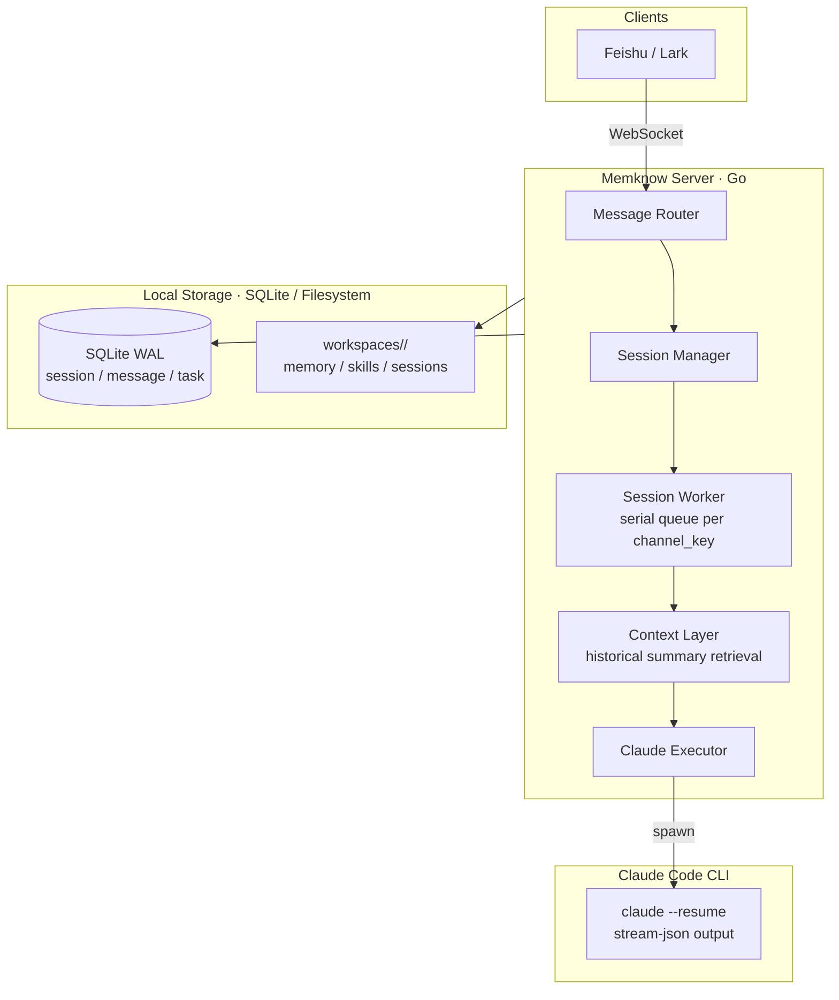

<div align="right">
  <span>[<a href="./README.md">English</a>]</span>
  <span>[<a href="./README.md">简体中文</a>]</span>
</div>

<div align="center">
  <h1>Memknow</h1>
  <p>A Feishu-based long-term memory AI Agent platform.</p>
  <p>Every bot is a digital companion with memory, personality, and the ability to grow.</p>
  <div align="center">
    
    
    
    
  </div>
  <br>
</div>

Memknow is a long-term memory AI Agent platform built on Feishu (Lark). Each business scenario maps to a Feishu app and an isolated Claude Code workspace. When a user sends a message in Feishu, the framework routes it to the corresponding workspace, invokes the `claude` CLI as a subprocess, and returns results via interactive cards.

> ⚠️ **Prerequisite**: This project must run on a machine where **Claude Code is installed and authenticated**. Memknow is a scheduler and bridge for Claude Code, not a replacement.

---

## Quick Start

### Prerequisites

- [Claude Code](https://docs.anthropic.com/claude-code) installed and authenticated
- Go 1.24+
- A Feishu enterprise account with a custom app and WS mode enabled

### Install and Run

```bash
git clone https://github.com/ashwinyue/Memknow.git
cd Memknow
go mod download
go build -o server ./cmd/server

cp config.yaml.template config.yaml
# Edit config.yaml with your Feishu credentials and workspace path
./server
```

For daemon mode and detailed deployment instructions, see `docs/quickstart.md`.

---

## Why Memknow?

- **Long-term memory**: Cross-session shared memory with automatic historical summary retrieval and prompt injection — the more you use it, the more it understands you.
- **Multi-app isolation**: One codebase supports multiple fully isolated AI Agent scenarios, each with its own workspace and memory.
- **Zero public IP**: Connects via Feishu WebSocket — no public IP required; deploy securely inside a corporate network.
- **Full Agent capabilities**: Integrates Claude Code's file I/O, Bash execution, and API calling capabilities seamlessly with Feishu.
- **Natural-language scheduling**: Create and manage scheduled tasks and heartbeats through conversation; the built-in scheduler executes them directly.

---

## Features

### Core

- **Multi-app isolation**: Each Feishu app gets an independent workspace with session directories isolated by `chat/heartbeat/schedule` for concurrency safety.
- **Automatic context injection**: Before every conversation, the framework retrieves summaries from archived sessions and injects them into prompts for continuous cross-session memory.
- **Smart session management**: P2P, group, and thread support; `/new` starts a fresh session, and idle timeout auto-archives with summary generation.
- **File-lock safety**: Cross-session shared memory is protected by `flock` file locks.

### Agent Capabilities

- **Full Claude Code power**: Read / Edit / Write / Bash / WebFetch are available out of the box; each workspace also includes a local `bin/web-search` entrypoint that prefers Tavily and falls back to DuckDuckGo.
- **Attachment support**: Images and files auto-download to session directories; pure-attachment messages are smart-cached until the user describes their intent.
- **Scheduled tasks**: Create schedules via natural language; the built-in `gocron` scheduler executes directly — no YAML needed.
- **Built-in heartbeat**: Framework-managed maintenance loop triggered by `config.yaml`, automatically reading `HEARTBEAT.md` for self-check tasks.
- **Skill on-demand loading**: The system prompt injects a compact index only; full skill content is read via `Read` when needed, preventing prompt bloat.

### Management

- **YAML configuration**: Single-file Viper-based config supporting multiple apps, allowlists, model overrides, and least-privilege tool permissions.
- **Lightweight runtime**: Go + SQLite WAL, CGO-free, zero external dependencies — runs well on edge devices.
- **Event tracking**: Structured case recording with time-based historical retrieval.

---

## Architecture



### channel_key Format

| Feishu Channel | channel_key Format | Supports /new |
|----------------|--------------------|---------------|
| P2P | `p2p:{chat_id}:{app_id}` | ✅ |
| Group | `group:{chat_id}:{app_id}` | ✅ |
| Thread | `thread:{chat_id}:{thread_id}:{app_id}` | ❌ |

---

## Project Structure

```
Memknow/
├── cmd/server/main.go          # Entry point
├── internal/
│   ├── config/                 # YAML configuration
│   ├── model/                  # GORM models
│   ├── db/                     # SQLite WAL connection
│   ├── claude/                 # Subprocess invocation of claude CLI
│   ├── feishu/                 # WS receiver + card sender
│   ├── session/                # Worker queues + memory retrieval + search
│   ├── schedule/               # Built-in task scheduler
│   ├── heartbeat/              # Built-in heartbeat scheduler
│   ├── cleanup/                # Attachment cleanup service
│   └── workspace/              # Workspace initialization
├── internal/workspace/template/# Default templates (embedded in binary)
├── workspaces/                 # Runtime workspaces (.gitignored)
├── docs/                       # Documentation
├── config.yaml.template        # Configuration template
├── Makefile                    # Common task wrappers
└── go.mod
```

### Local Search Entrypoint

Each workspace is initialized with:

- `bin/web-search`: a unified local search command the bot can call directly
- `.search.json`: runtime search config derived from `config.yaml`

Default behavior:

- Prefer Tavily when `web_search.tavily_api_key` is configured
- Fall back to DuckDuckGo when Tavily is missing or fails
- Return normalized JSON for the bot to inspect and continue from

---

## Development

```bash
go build ./...
go test ./...
go vet ./...
gofmt -w .
```

For more documentation, see the `docs/` directory.

---

## License

[MIT License](LICENSE)
