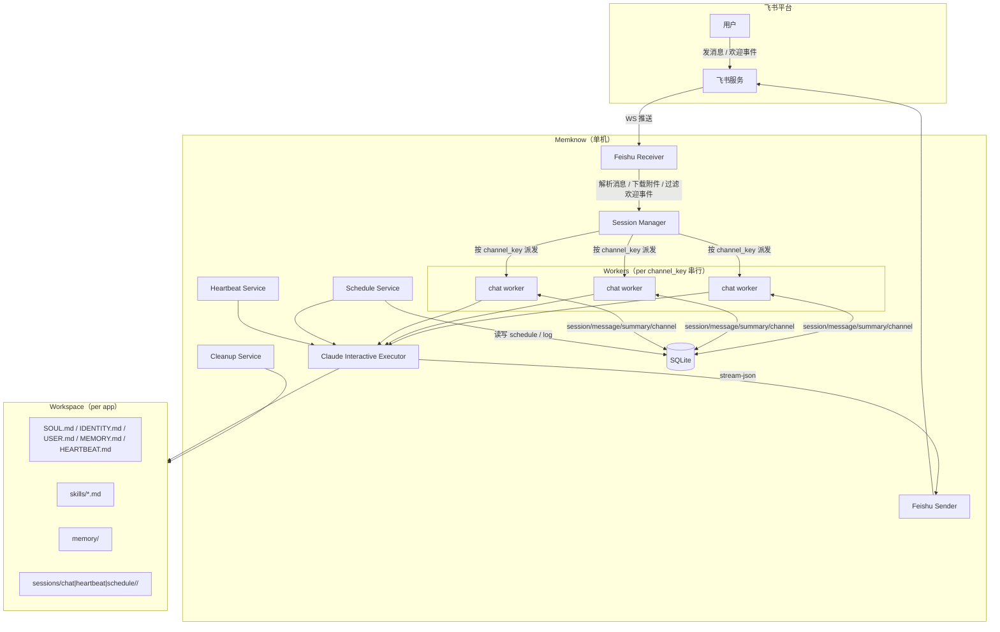
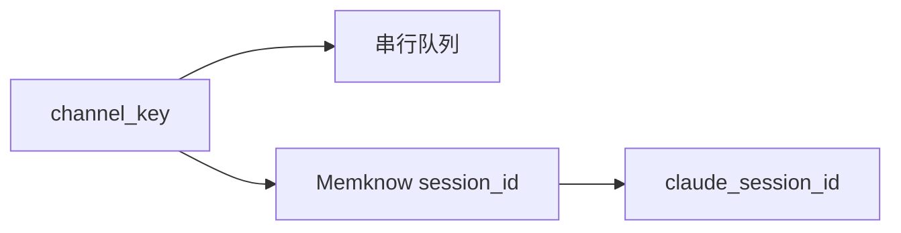
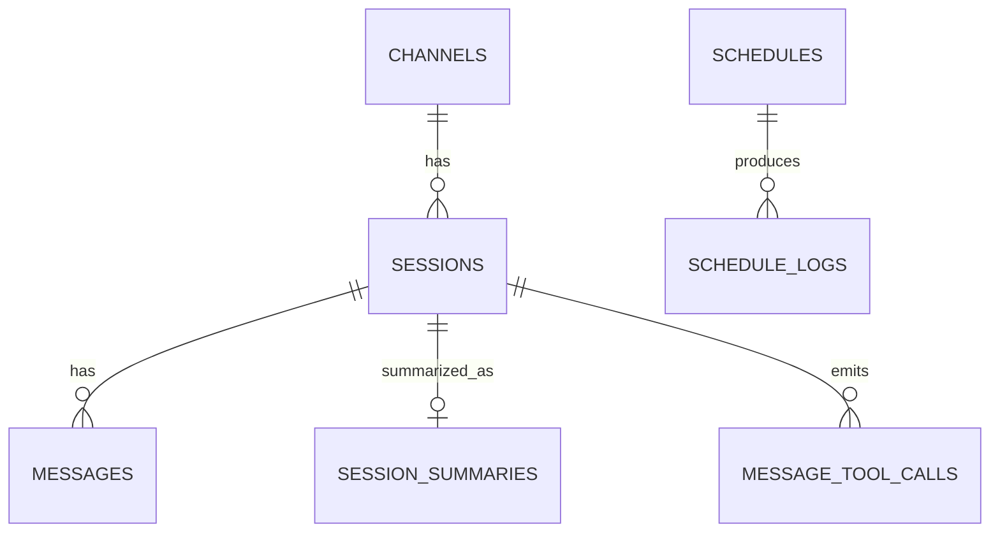
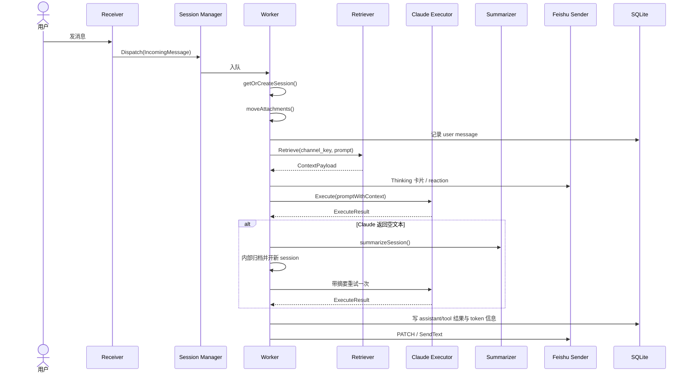

# 系统设计文档

> 状态: 已实现
> 最后更新: 2026-04-10

## 一、系统概览

Memknow 是一个基于 Feishu 的长期记忆 AI Agent 平台。每个飞书应用对应一个独立的 workspace，用户消息经飞书 WebSocket 推送到本地服务后，被路由到对应 workspace 的 session 目录中执行 `claude` CLI。框架负责消息接入、会话编排、上下文增强、调度、存储与结果回传。

核心目标：

- 多应用隔离：每个 bot 拥有独立 workspace、独立配置、独立记忆
- 长期连续性：保留 Claude `--resume` 的上下文能力，同时补齐跨 session 检索与摘要
- 主动执行：支持自然语言创建 schedule，支持 heartbeat 自检
- 内网可部署：使用飞书 WebSocket 长连接，无需公网入口

部署约束：单机、单进程、SQLite WAL、子进程 Claude CLI、单机 gocron。

---

## 二、整体架构



---

## 三、核心概念

### 3.1 Application

每个飞书应用映射到一个本地 workspace：

- 配置来源：`config.yaml`
- 工作目录：`app.workspace_dir`
- 身份隔离：不同 app 使用不同 Feishu 凭证、不同 Sender、不同 workspace

### 3.2 Channel、Session、Claude Session



- `channel_key`：飞书会话的稳定键，对应一个常驻 Worker
- `session_id`：Memknow 自己的会话 ID，对应本地 `sessions/<type>/<id>/`
- `claude_session_id`：Claude CLI 内部 session ID，用于 `--resume`

### 3.3 Channel Key 规则

> P2P 使用飞书 `chat_id`，不是用户 `open_id`。

| 场景 | channel_key |
|---|---|
| 单聊 | `p2p:{chat_id}:{app_id}` |
| 群聊 | `group:{chat_id}:{app_id}` |
| 话题群 | `thread:{chat_id}:{thread_id}:{app_id}` |
| Heartbeat | `heartbeat:{app_id}` |

### 3.4 Session 类型

运行时 session 目录与数据库 `sessions.type` 保持一致：

- `chat`
- `heartbeat`
- `schedule`

目录布局：

- `sessions/chat/<session-id>/`
- `sessions/heartbeat/<session-id>/`
- `sessions/schedule/<session-id>/`

---

## 四、数据模型

主要表：

- `channels`：稳定的飞书 channel 元数据
- `sessions`：Memknow 会话，记录 `type`、`claude_session_id`、状态、token 统计
- `messages`：用户、assistant、tool 消息
- `message_tool_calls`：结构化工具调用记录
- `session_summaries`：归档 session 摘要
- `schedules`：内置 schedule 定时任务
- `schedule_logs`：schedule 执行记录



说明：

- `schedule` 已经完全落在 DB，不再依赖 `tasks/*.yaml`
- `heartbeat` 通过内置服务触发，不写 YAML
- 归档 session 会生成 `session_summaries`，供后续检索注入

---

## 五、消息处理主链路

### 5.1 接收与标准化

`feishu.Receiver` 负责：

- 建立 WebSocket 长连接
- 解析 `text` / `post` / `image` / `file`
- 下载附件到 `os.TempDir()`
- 判断群聊里是否明确提到当前 bot、是否回复给当前 bot、是否点名其他 bot
- 构造 `IncomingMessage`

欢迎事件直接由框架返回固定卡片，不进入 Claude 执行链路。

### 5.2 队列与串行执行

`session.Manager` 以 `channel_key` 为键懒启动 Worker：

- 同一 `channel_key` 串行
- 不同 `channel_key` 并发
- Worker 空闲超时后退出
- 最近 5 分钟内的飞书重复投递会去重

### 5.3 Worker 执行流程



### 5.4 附件处理

两段式处理：

1. `Receiver` 下载到系统临时目录
2. `Worker.moveAttachments()` 把文件移入当前 session 的 `attachments/`

注入给 Claude 的占位格式：

- `[图片: /absolute/path/to/file.jpg]`
- `[文件: /absolute/path/to/file.pdf]`

纯附件消息不会立即调用 Claude，而是先缓存并提示用户补充意图；下一条文字消息会自动合并发送。

### 5.5 `/new`

`/new` 只对 `chat` session 生效：

- 当前 session 归档
- 生成新的 `session_id`
- 清空 `claude_session_id`
- 下一条消息不带 `--resume`

话题群不支持 `/new`。

---

## 六、Context Layer（已并入主设计）

Memknow 不替代 Claude 自己的 `--resume` 机制，只补三类能力：

1. 跨 session 记忆
2. 历史检索
3. 上下文溢出自动兜底

### 6.1 会话摘要

归档时机：

- `/new`
- Worker 空闲退出
- 空结果兜底流程

`Summarizer` 会读取当前 session 的消息，调用 Claude 生成 1-3 句话摘要，落入 `session_summaries` 表。

### 6.2 检索注入

`Retriever` 在每次执行前做两类查询：

- 最近归档 session 的摘要
- FTS5 历史消息检索结果

只查 archived session，避免和当前 `--resume` 上下文重复。

### 6.3 Overflow Recovery

当 Claude 返回空文本时，Worker 会：

1. 摘要当前 session
2. 透明归档并开新 session
3. 将摘要作为前序上下文重试一次

用户最终只看到一条结果，不需要手动 `/new`。

---

## 七、Prompt 注入与 Workspace 分层

### 7.1 注入链路

Claude 子进程启动时通过 `--append-system-prompt` 动态拼接：

1. 基础 session prompt
   - `internal/claude/prompts/chat.md`
   - `internal/claude/prompts/heartbeat.md`
   - `internal/claude/prompts/schedule.md`
2. Workspace prompt
   - `SOUL.md`
   - `IDENTITY.md`
   - `skills/*.md` 的紧凑索引

框架不再生成 session 级 `CLAUDE.md`。

### 7.2 文件职责

| 文件 | 职责 |
|---|---|
| `chat.md` / `heartbeat.md` / `schedule.md` | 框架级约束：路径规则、信任边界、安全规则、模式差异 |
| `SOUL.md` | bot 的人格、行为原则、群聊分寸、业务边界 |
| `IDENTITY.md` | bot 自我定义 |
| `USER.md` | 用户画像 |
| `MEMORY.md` / `memory/*.md` | 长期记忆 |
| `HEARTBEAT.md` | heartbeat 检查清单 |
| `skills/*.md` | 环境相关或场景特定操作知识 |

### 7.3 SESSION_CONTEXT.md

每次执行前写入当前 session 目录，提供绝对路径与运行时元数据，例如：

- workspace 路径
- session 路径
- attachments 路径
- DB 路径
- channel key

这样 Claude 和 skills 都基于绝对路径工作，避免相对路径歧义。

---

## 八、群聊触发策略

群聊不是“逢消息必回”，当前实现分两层：

1. `Receiver` 先做显式过滤
   - 明确提到别的 bot：忽略
   - 回复的是别的对象：忽略
   - 群聊中点名的是其他 app id：忽略
2. `Worker` 对未直接提及当前 bot 的消息运行 probe
   - probe 只允许输出 `RESPOND` 或 `IGNORE`
   - 默认倾向 `IGNORE`

因此最终回复策略是“框架先保守过滤，再由 Claude 决定是否值得插话”，而不是完全由 `SOUL.md` 独自决定。

---

## 九、Schedule、Heartbeat、Cleanup

### 9.1 Schedule

用户通过自然语言创建 schedule。`schedule.Service` 负责：

- 识别提醒/定时意图
- 解析成 cron + command + target
- 持久化到 `schedules`
- 启动时自动从 DB 恢复 enabled 任务
- 触发时创建 `schedule` 类型 session 调用 Claude

默认目标：

- P2P：当前私聊用户
- Group：当前群聊

### 9.2 Heartbeat

`heartbeat.Service` 是独立内置循环：

- 读取 workspace 下的 `HEARTBEAT.md`
- 以 `heartbeat` 类型 session 执行
- 可选择把结果发送到配置指定的 chat

Heartbeat 不依赖 YAML task 文件。

### 9.3 Cleanup

`cleanup.Service` 由 gocron 定时触发，清理已归档 session 的 `attachments/`：

- 常规保留天数：`attachments_retention_days`
- 强制上限：`attachments_max_days`

只删除附件目录，不删 session 和数据库记录。

---

## 十、并发与安全

### 10.1 并发模型

- `channel_key` 级别串行
- app 级 workspace 隔离
- session 级目录隔离写操作
- `memory/` 等共享资源通过锁文件与约定保护

### 10.2 安全边界

- 附件下载上限 100 MiB
- HTTP 服务设置 read/write/idle timeout
- 使用进程组与 `WaitDelay` 避免 Claude 子进程泄漏
- 过滤继承的 `CLAUDECODE` / `CLAUDE_CODE_*` 环境变量，避免嵌套会话污染
- 使用单实例文件锁，防止重复启动

### 10.3 优雅关闭

关闭顺序：

1. cancel 根 context
2. 等待 session workers 退出
3. 停止 executor 后台 reaper
4. 停止 schedule service
5. HTTP server `Shutdown(10s)`

---

## 十一、Workspace 与项目结构

### 11.1 运行时 workspace

```text
<workspace_dir>/
├── bin/
│   └── web-search
├── SOUL.md
├── IDENTITY.md
├── USER.md
├── MEMORY.md
├── HEARTBEAT.md
├── .search.json
├── skills/
├── memory/
├── sessions/
│   ├── chat/
│   ├── heartbeat/
│   └── schedule/
├── .memory.lock
└── .skill.lock
```

### 11.2 代码结构

```text
cmd/server/main.go           启动入口
internal/config/             配置加载与校验
internal/db/                 SQLite 初始化
internal/model/              GORM 模型
internal/feishu/             飞书接入与回消息
internal/session/            Worker、历史检索、摘要
internal/claude/             Claude CLI interactive executor
internal/schedule/           定时任务服务
internal/heartbeat/          心跳服务
internal/cleanup/            附件清理
internal/websearch/          本地联网搜索（Tavily / DuckDuckGo）
internal/workspace/          workspace 初始化与模板
```

---

## 十二、配置要点

关键配置项：

- `apps[]`：Feishu 凭证、workspace 路径、allowed_chats、Claude 工具权限
- `server.port`
- `claude.max_turns`
- `session.worker_idle_timeout_minutes`
- `heartbeat.enabled / interval_minutes / prompt_file / notify_target_*`
- `web_search.tavily_api_key / tavily_base_url / timeout_seconds`
- `cleanup.*`

`Claude CLI` 的认证、base URL 等运行环境由用户本机的 Claude 配置管理，Memknow 不额外落本地凭证文件。

---

## 十三、设计决策总结

| 决策点 | 当前结论 |
|---|---|
| Claude 会话管理 | 保留 `--resume`，不自建一套上下文状态机 |
| 跨 session 记忆 | 用摘要 + FTS5 检索补齐 |
| Prompt 分层 | 基础 prompt 管框架约束，workspace 文件管 bot 个性 |
| 定时任务 | DB 持久化 + gocron，不写 YAML |
| Heartbeat | 内置服务读取 `HEARTBEAT.md` |
| 群聊参与 | 框架先过滤，Claude probe 再决定是否响应 |
| 隔离粒度 | app 级 workspace + channel 级串行 + session 级目录 |
| 部署方式 | 单机单进程优先，先保证本地可维护性 |
